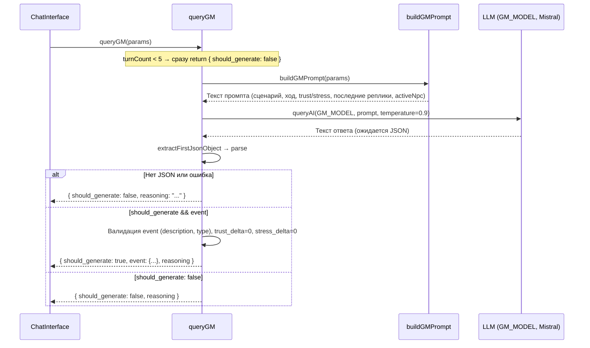

# Диаграммы последовательности: от ввода пользователя до ответа LLM

## 1. Общая логика приложения (один ход: вопрос учителя → ответ ученика)

```mermaid
sequenceDiagram
    autonumber
    actor User as Учитель (пользователь)
    participant UI as ChatInterface
    participant GM as geminiService.queryGM
    participant LLM_GM as LLM (GM_MODEL)
    participant Student as geminiService.sendMessageToGemini
    participant LLM_Student as LLM (CHAT_MODEL)

    User->>UI: Вводит реплику и нажимает «Отправить»
    UI->>UI: Добавить user message в state, saveSessionBackup
    UI->>UI: Проверка: turnCount ≥ 5 и messagesSinceLastEvent ≥ MIN?

    alt Нужно спросить GM о событии
        UI->>GM: queryGM(сценарий, trust, stress, recentMessages, activeNpc, ...)
        GM->>LLM_GM: buildGMPrompt + queryAI(GM_MODEL, temp=0.9)
        LLM_GM-->>GM: JSON { should_generate, event?, reasoning }
        GM-->>UI: gmDecision; при true → gmEvent
    end

    UI->>Student: sendMessageToGemini(history, constructedPrompt, text, gmEvent?)
    Note over Student: Если gmEvent ≠ null: добавить блок «ВНЕШНЕЕ СОБЫТИЕ» в system prompt
    Student->>Student: Собрать messages: system + history (user/assistant как JSON state)
    Student->>LLM_Student: postViaProxy(openrouter:CHAT_MODEL, messages)
    LLM_Student-->>Student: raw response (текст с JSON)
    Student->>Student: extractModelText → extractFirstJsonObject → normalizeChatJson
    Student->>Student: Защита: если prev 40/70 → 0/100, то game_over=false, trust=25, stress=90
    Student-->>UI: { text, thought, trust, stress, world_event?, event_reaction?, game_over, ... }

    UI->>UI: Валидация trust/stress (clamp ±MAX_DELTA), event_reaction → finalTrust/finalStress
    UI->>UI: Сформировать model message, добавить в state
    alt game_over и (failure или triumph)
        UI->>UI: Переход к анализу / комиссии
    end
    UI->>User: Отобразить реплику ученика и метрики
```

---

## 2. Логика GM (когда и как вызывается, что возвращает)



---

## 3. Логика ученика (sendMessageToGemini: промпт, вызов LLM, парсинг)

```mermaid
sequenceDiagram
    participant UI as ChatInterface
    participant Svc as sendMessageToGemini
    participant LLM as LLM (CHAT_MODEL, Claude)

    UI->>Svc: sendMessageToGemini(history, systemPrompt, lastUserMessage, gmEvent?)
    Svc->>Svc: finalPrompt = systemPrompt [+ блок «ВНЕШНЕЕ СОБЫТИЕ» если gmEvent]
    Svc->>Svc: messages = [{ system: finalPrompt + JSON-инструкция }, ...history]
    Note over Svc: user → content как есть; assistant → JSON.stringify(msg.state)
    Svc->>LLM: postViaProxy(openrouter:CHAT_MODEL, { messages, max_tokens, temperature })
    LLM-->>Svc: data (OpenRouter response)
    Svc->>Svc: extractModelText(data) → modelText
    Svc->>Svc: extractFirstJsonObject(modelText) → jsonStr
    alt jsonStr есть
        Svc->>Svc: JSON.parse → normalizeChatJson (thought, speech→text, trust, stress, world_event, game_over, ...)
        Svc->>Svc: Safeguard: если prevTrust>40, prevStress<70 и result 0/100 + game_over → перезаписать game_over=false, trust=25, stress=90, safeguard_applied
        Svc-->>UI: result (GeminiChatResponse)
    else нет JSON (fallback)
        Svc->>Svc: Взять prev trust/stress из последнего model message
        Svc-->>UI: fallback-ответ (без game_over по смыслу «ошибка формата»)
    end
```

---

## 4. Логика суфлёра (по кнопке «Подсказка»: от запроса до совета)

```mermaid
sequenceDiagram
    actor User as Учитель (админ)
    participant UI as ChatInterface
    participant Ghost as generateGhostResponse
    participant LLM as LLM (GHOST_MODEL, Claude)

    User->>UI: Нажимает «Подсказка» (суфлер)
    UI->>UI: Собрать lastModelMsg (trust, stress, world_event, active_npc); previousAdvice
    UI->>Ghost: generateGhostResponse(history, contextSummary, { accentuation, intensity, currentTrust, currentStress, previousAdvice, teacherName, worldEvent, activeNpc })
    Ghost->>Ghost: transcript = история в виде «УЧЕНИК [trust%, stress%]: content» / «УЧИТЕЛЬ: content»
    Ghost->>Ghost: Собрать промпт: контекст, психотип, метрики, ИСКЛЮЧИТЬ (previousAdvice), РАЗНООБРАЗИЕ ПОДСКАЗОК, алгоритм (техники по trust/stress)
    Ghost->>LLM: queryAI(GHOST_MODEL, prompt, temp=0.7)
    LLM-->>Ghost: Текст ответа (ожидается JSON { analysis, technique, advice })
    Ghost->>Ghost: extractFirstJsonObject → parse
    Ghost-->>UI: parsed.advice (строка — готовая реплика для учителя)
    UI->>UI: setGhostAdvice(advice); previousAdvice.push(advice)
    UI->>User: Показать подсказку в блоке «Суфлер» (можно «Использовать» → подставить в поле ввода)
```

---

## Участники и модели

| Участник в диаграмме | Реальный код / модель |
|----------------------|------------------------|
| ChatInterface        | `components/ChatInterface.tsx` |
| queryGM              | `services/geminiService.ts` → `buildGMPrompt` из `prompts/gmPrompt.ts` |
| sendMessageToGemini  | `services/geminiService.ts` |
| generateGhostResponse| `services/geminiService.ts` |
| LLM (GM_MODEL)       | `mistralai/mistral-large-2411` |
| LLM (CHAT_MODEL)     | `anthropic/claude-3.7-sonnet:thinking` (ученик) |
| LLM (GHOST_MODEL)    | `anthropic/claude-3.7-sonnet` (суфлер) |

---

## Краткий общий поток (без альтов)

```
Учитель вводит реплику
  → ChatInterface сохраняет сообщение
  → (если пора) queryGM → LLM GM → событие или нет
  → sendMessageToGemini(history, prompt, text, gmEvent)
      → дополнение промпта событием (если есть)
      → LLM Student → JSON ответ ученика
      → парсинг, защита от резкого 0/100
  → ChatInterface валидирует trust/stress, формирует ответ
  → Отображение реплики ученика и метрик
```

Суфлер вызывается отдельно по кнопке: `generateGhostResponse` → LLM Ghost → одна строка совета.
